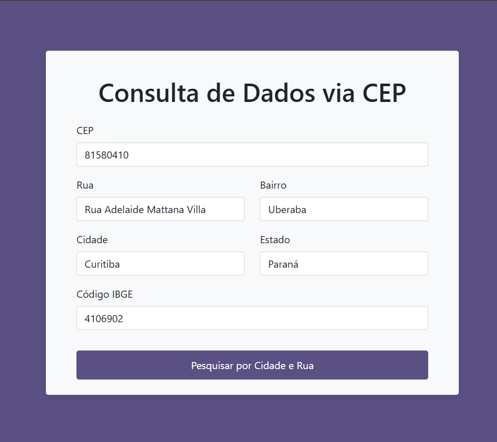
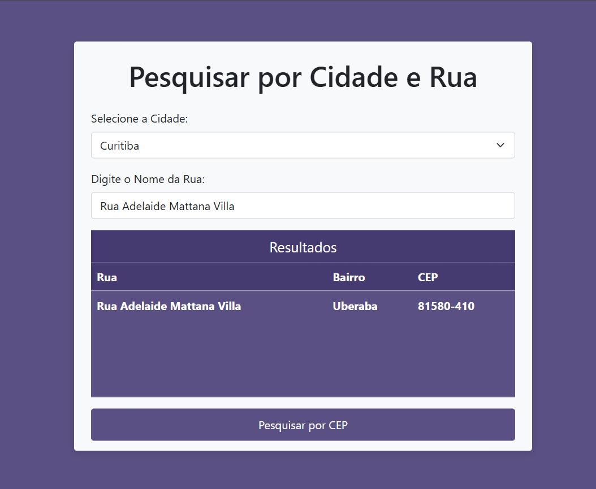

# API ViaCep

Projeto para consumir a api `ViaCep`, retornando dados sobre endereços com base no CEP ou nas ruas de uma cidade no estado do Paraná.

## Funcionalidades
- Consulta por CEP
- Consulta por Cidade e Rua

### Consulta por CEP
- No campo `CEP`, informe o CEP. Ex: `81580410`
- Ao desfocar o campo, será feita a requisição
- Caso não encontre, exibirá a mensagem `Nenhum resultado encontrado!`
- Caso encontre, serão exibidos os seguintes dados:
    - Rua
    - Bairro
    - Cidade
    - Estado
    - Código do IBGE

Consulta por CEP:

### Consulta por Cidade e Rua
- Escolha uma cidade. Ex: `Curitiba`.
- Escolha a rua. Ex: `Rua Adelaide Mattana Villa`.
- Ao desfocar o campo da rua, será feita a requisição.
- Caso não encontre, exibirá a mensagem `Nenhum resultado encontrado!`
- Caso encontre, serão exibidos os seguintes dados:
    - Rua
    - Bairro
    - CEP

Consulta por Cidade e Rua:

